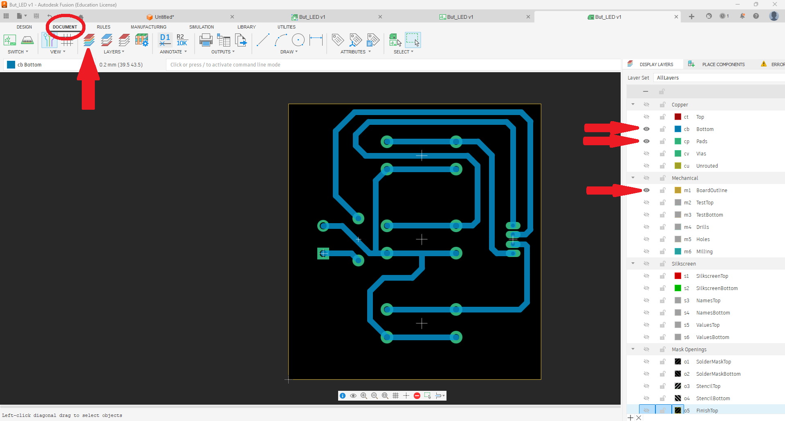
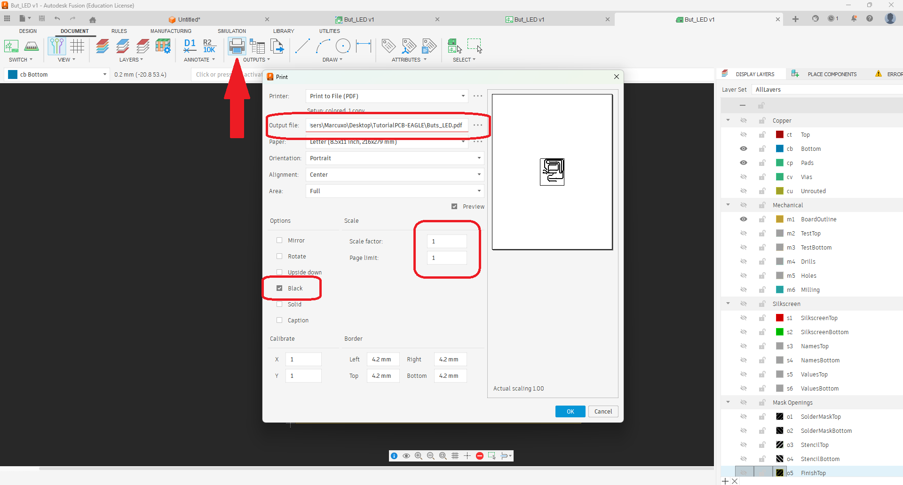
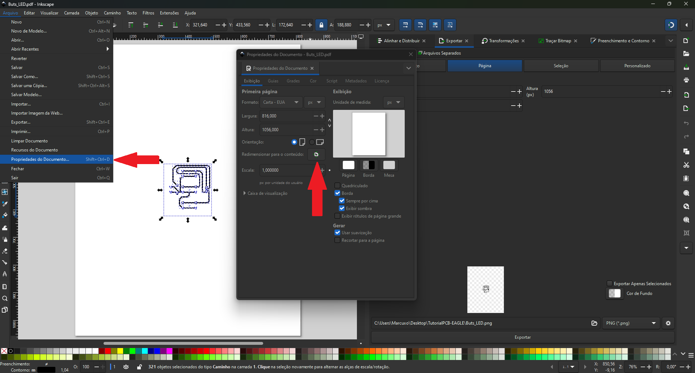
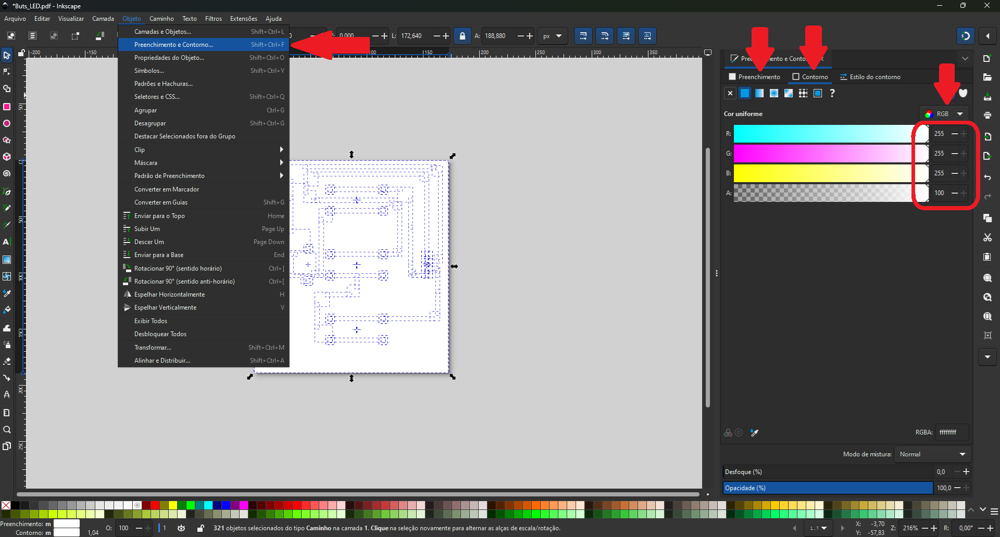
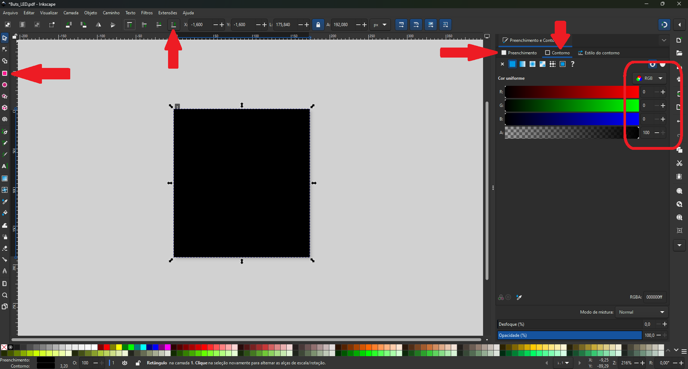
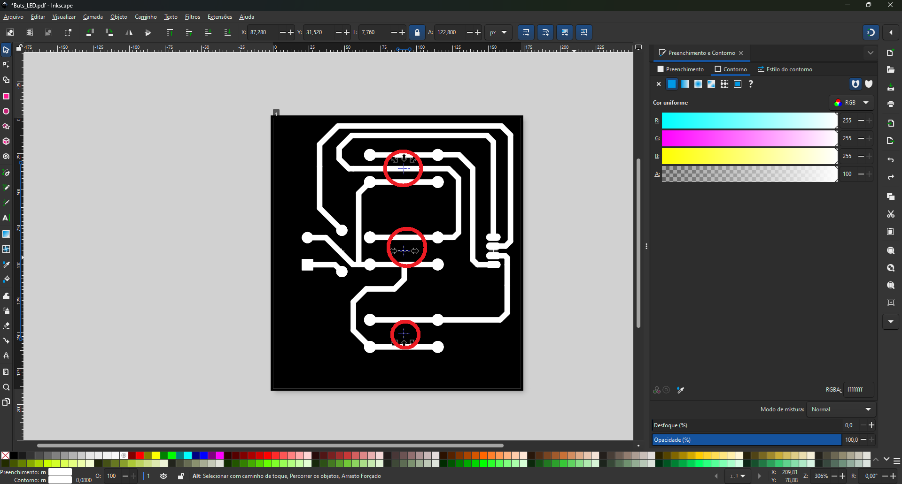
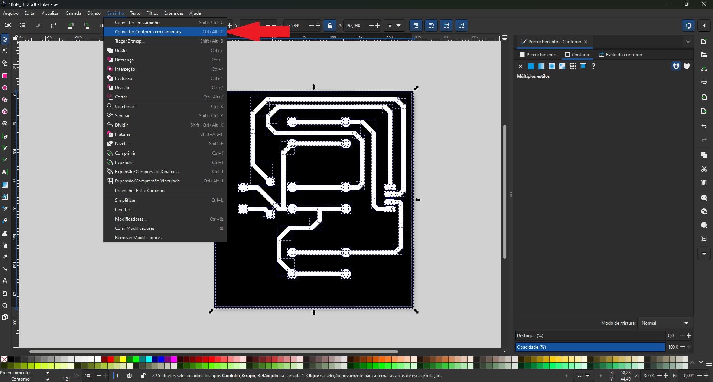
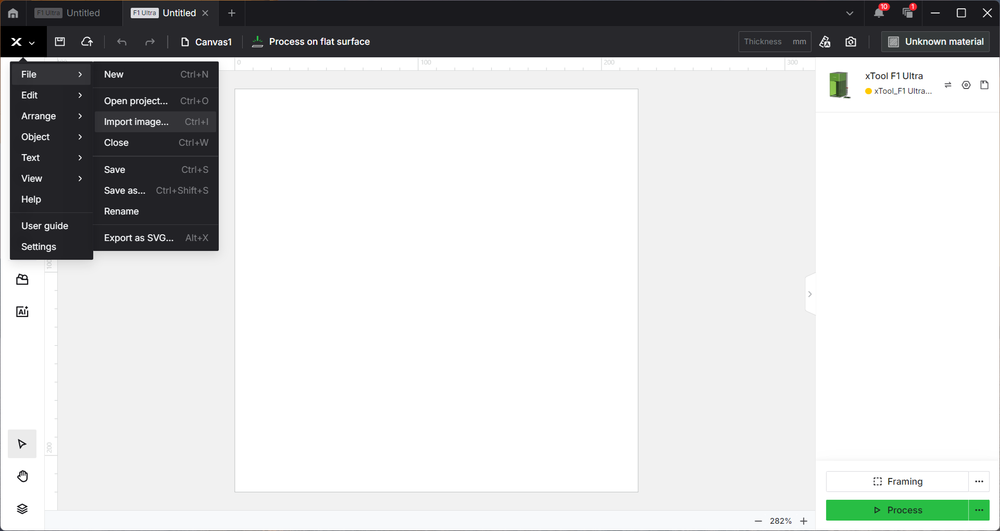
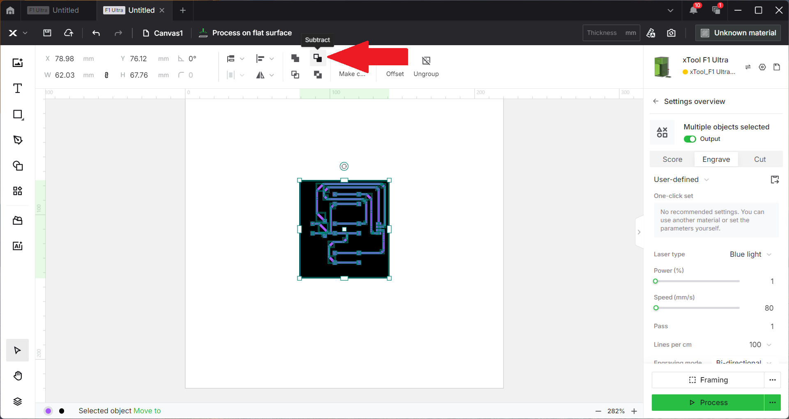
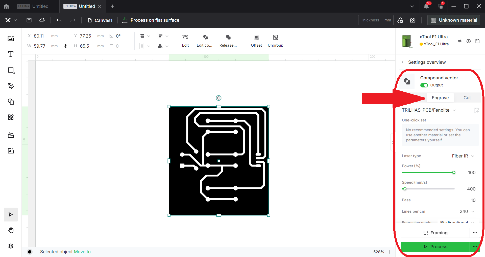

# Fabricação de PCB com xTool F1 Ultra usando Autodesk Fusion

## 📌 Visão Geral

Este tutorial descreve o processo completo de fabricação de placas de circuito impresso (PCB) utilizando a máquina **xTool F1 Ultra** em conjunto com o **Autodesk Fusion**.

O objetivo é demonstrar um fluxo prático para prototipagem rápida de PCBs por **gravação a laser**, desde o design até o acabamento final.

---

## 🛠️ Materiais Necessários

- Placa de cobre (fenolite)
- Máquina a laser xTool F1 Ultra
- Lixa fina ou esponja abrasiva

---

## 💻 Softwares Utilizados

- Autodesk Fusion (CAD/CAM)
- Inkscape (edição vetorial)
- Software da xTool (controle da máquina)

---

## 🔄 Fluxo do Processo

1. Exportação do circuito no Fusion (.PDF)
2. Conversão e ajuste no Inkscape (.SVG)
3. Configuração e gravação no xTool

---

## 📐 Etapa 1: Exportação do circuito no Fusion

Após finalizar o layout da PCB:

1. Selecione as camadas (layers) a serem exportadas
 

2. Clique em imprimir, deixe a escala em *1:1*, selecione a opção **Black** e salve o arquivo em formato .pdf
   

---

## 📤 Etapa 2: Preparação do arquivo no Inkscape

Abra o arquivo **.PDF** no Inkscape e siga:

1. Ajuste o tamanho da página para o tamanho da PCB

   
2. Selecione todas as trilhas (CTRL + A), clique em **Objeto > Preenchimento e Contorno**  
   Insira **Preenchimento** e **Contorno**, ambos na cor **branca**, conforme a imagem abaixo:

3. Selecione a ferramenta Retângulo na cor **preta** e cubra toda a página.  
   Após isso, clique no botão **Enviar a seleção para a base**

4. Remova elementos desnecessários

5. Selecione toda a página e clique em **Caminho > Converter contorno em caminhos**

6. Salve o arquivo no formato .svg

---

## 🧩 Etapa 3: Configuração da máquina no xTool

1. Abra o software da xTool e importe o arquivo .svg

2. Clique em **Subtract**

3. Caso a gravação seja do layer **BOTTOM**, será necessário espelhar as trilhas.  
   Após isso, insira os parâmetros de **Engrave (gravação)**

---

## 🔩 Etapa 4: Finalizando

A xTool F1 Ultra **não é ideal para furação de PCBs**, então:

- Utilize uma furadeira de bancada **ou** um perfurador de placa de circuito impresso

Após isso:

- Lixe levemente a superfície

---

## ✅ Resultado Esperado

---
